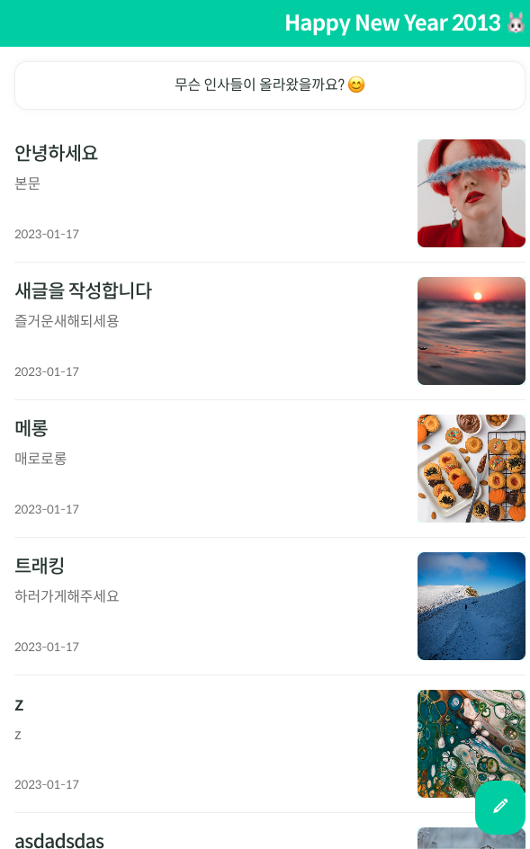

# Vanlia JS로 SPA 구현하기! 🍨

바닐라JS라고 써있지만 타입스크립트로 구현한 SPA 기반 게시판 입니다.

<br>

## 프로젝트 실행 방법 🚀

---

```
npm run dev
```

<br>

## 사이트 주소 🪩

---

http://ts-spa.s3-website.ap-northeast-2.amazonaws.com/

<br>

## 페이지 소개 🌁

---

<table>
  <tr>
    <td>메인 페이지</td>
    <td>게시글 작성 페이지</td>
    <td>상세 페이지</td>
    <td>수정하기 페이지</td>
  </tr>
  <tr>
    <td>
      
    </td>
    <td>
     
    </td>
     <td>
      
    </td>
    <td>
     
    </td>
  </tr>
  
</table>

<br>

## 기술 스택 🛠️

---

- typescript : Class를 좀더 명시적으로 작성 + 타입 지정으로 안전한 코드 작성 위함
- webpack : spa를 구현하기 위한 환경 셋팅 + 번들러
- scss : 스타일 코드들을 구분하여 조금 더 효율적으로 관리하기 위한 css 전처리기

<br>

## 디렉토리 구조 📂

---

<details markdown="1">
<summary>자세히 보기</summary>

```
.
├── README.md
├── package-lock.json
├── package.json
├── index.html
├── src
│   ├── index.ts
│   ├── pages
│   │   ├── mainpage.ts
│   │   ├── writepage.ts
│   │   ├── editpage.ts
│   │   ├── detailpage.ts
│   │   └── notFoundpage.ts
│   ├── components
│   │   └── CommonHeader.ts
│   ├── constants
│   │   └── index.ts
│   ├── shared
│   │   └── service
│   │       ├── index.ts
│   │       ├── postService.ts
│   │       └── commentService.ts
│   └── types
│        └── index.ts
├── styles
│   ├── index.scss
│   ├── components
│   ├── constants
│   ├── layouts
│   └── mixin
|
├── prettierrc.json
├── babel.config.json
├── tsconfig.json
├── webpack.common.js
├── webpack.dev.js
└── webpack.prod.js
```

</details>

<br>

- `/src/*` : ts 파일들
  - `components`
    - `CommonHeader.ts` : 모든 페이지 상단의 공통 Header
  - `constants`
    - `index.ts` : 프로젝트에 쓰이는 상수 모음
  - `pages`
    - `mainpage.ts` : 게시글 리스트 페이지
    - `detailpage.ts` : 게시글 상세 페이지
    - `writepage.ts` : 작성하기 페이지
    - `editpage.ts` : 수정하기 페이지
    - `notFoundpage.ts` : 404 페이지
  - `shared`
    - `service` : API 정의
      - `index.ts` : get, post, patch, delete API 추상화
      - `postService.ts` : 게시글 관련 API 모음
      - `commentService.ts` : 댓글 관련 API 모음
    - `utils.ts` : 유틸함수 모음
  - `types`
    - `index.ts` : 프로젝트의 타입들 정의

<br>

- `/styles/*` : scss 파일들
  - `base` : 아이콘 폰트 및 css 초기화 파일들
  - `components` : 공통으로 쓰이는 요소들의 스타일
  - `constants` : 컬러, 타이포그래피
  - `layouts` : 페이지 단위 스타일
  - `mixin` : scss 함수 파일
  - `index.scss` : 모든 scss 파일을 import 해놓은 root

<br>

- `webpack.common.js` : webpack 공통 setting
- `webpack.dev.js` : webpack dev-server 환경 setting
- `webpack.prod.js` : webpack 빌드 setting

<br>

## 주요 기능 🧑🏼‍🏫

---

- spa기반 페이지 라우팅
- 게시글 list 조회
- 게시글 작성
- 게시글 수정
- 게시글 삭제
- 상세 게시글 조회
- 댓글 작성
- 댓글 삭제
- UnSplash API를 활용한 랜덤이미지 조회

<br>

## 주요 메서드 및 함수 🧑🏻‍💻

---

### 라우터(핵심)

- `navigate(url, replaceOption)` : 페이지를 이동시킬때 사용하는 메서드
- `pathToRegex(path)` : 페이지 이동시 url을 받아서 정규식을 return 하는 메서드
- `getParams(targetPage)` : 현재 페이지 정보가 담긴 객체를 받아서 파라미터를 객체로 return 해주는 메서드
- `router()` : 페이지 url이 바뀔때 페이지 컴포넌트들을 그려주는 메서드

### 메인 페이지

- `attchPostPreviews(posts, parentElement)` : posts(게시글 List)를 htmlStringTemplate으로 만들어 부모 요소에 부착 시키는 메서드
- `render()` : 실제 페이지가 렌더링되고 해당 페이지 로직 실행 메서드

### 작성하기 페이지

- `attachPreviewImage(imageUrl, args, parentElement)` : unsplash에서 받아온 이미지 정보를 htmlStringTemplate으로 만들어 부모요소에 부착 시키는 메서드

- `render()` : 실제 페이지가 렌더링되고 해당 페이지 로직 실행 메서드

### 게시글 상세페이지

- `attchComment(comments, parentElement)` : comments(댓글 List)를 htmlStringTemplate으로 만들어 부모 요소에 부착 시키는 메서드

- `render()` : 실제 페이지가 렌더링되고 해당 페이지 로직 실행 메서드
